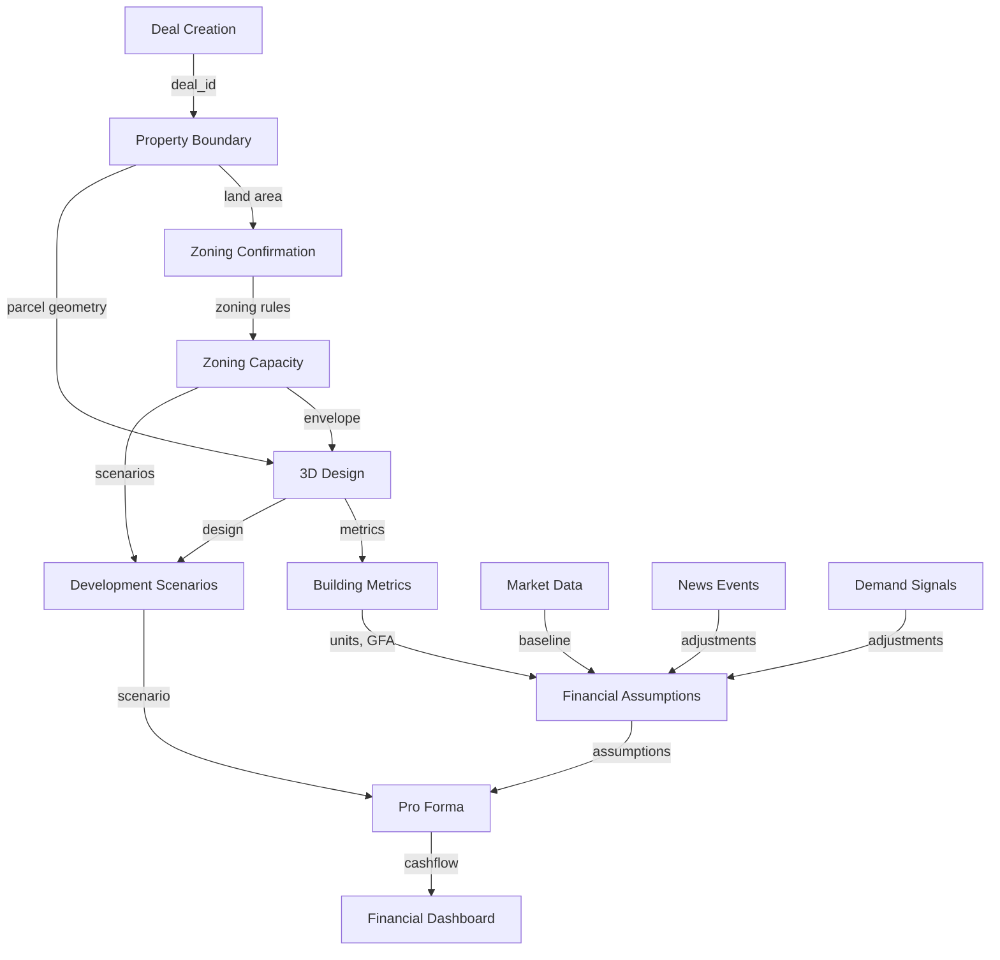

# JediRe Complete Data Flow Map
## From Deal Creation → 3D Design → Financial Dashboard

**Last Updated:** 2026-03-03  
**Purpose:** Map the complete data pipeline to understand what each module needs and how data flows between them.

---

## 🎯 Overview: The Complete Pipeline

```
DEAL CREATION
    ↓
PROPERTY BOUNDARY (Parcel)
    ↓
ZONING CONFIRMATION
    ↓
ZONING CAPACITY ANALYSIS
    ↓
3D BUILDING DESIGN ←→ DEVELOPMENT SCENARIOS
    ↓
BUILDING METRICS (Units, GFA, Parking)
    ↓
FINANCIAL ASSUMPTIONS (Rent, Vacancy, OpEx)
    ↓
PRO FORMA GENERATION
    ↓
FINANCIAL DASHBOARD (IRR, NPV, Cash Flow)
```

---

## 📊 Detailed Module-by-Module Data Flow

### Module 1: Deal Creation
**API:** `POST /api/v1/deals`  
**Database Table:** `deals`  
**State:** `SIGNAL_INTAKE` (initial state)

**Input Data:**
```json
{
  "name": "Atlanta Development",
  "address": "1950 Piedmont Circle NE, Atlanta, GA 30324",
  "projectType": "multifamily",
  "targetUnits": 300,
  "budget": null,
  "boundary": {
    "type": "Polygon",
    "coordinates": [[...]]  // Optional on create
  }
}
```

**Database Record Created:**
```sql
INSERT INTO deals (
  user_id, name, boundary, project_type, target_units,
  tier, deal_category, address, state, status
) VALUES (...);
```

**Outputs:**
- `deal.id` (UUID)
- `deal.state` = `'SIGNAL_INTAKE'`
- `deal.tier` = `'basic'|'pro'|'enterprise'`
- Initializes modules based on tier
- Initializes pipeline stages

**What Happens Next:**
1. Auto-triage service runs (background)
2. Deal modules initialized: `deal_modules` table
3. Pipeline initialized: `deal_pipeline` table
4. Activity logged: `deal_activities` table

---

### Module 2: Property Boundary
**API:** `POST /api/v1/deals/:dealId/boundary`  
**Database Table:** `property_boundaries`  
**State Transition:** `SIGNAL_INTAKE` → `TRIAGE`

**Input Data:**
```json
{
  "boundaryGeoJSON": {
    "type": "Polygon",
    "coordinates": [[
      [-84.3667, 33.8200],
      [-84.3665, 33.8200],
      [-84.3665, 33.8198],
      [-84.3667, 33.8198],
      [-84.3667, 33.8200]
    ]]
  },
  "parcelArea": 4.5,           // acres
  "parcelAreaSF": 196020,      // square feet
  "setbacks": {
    "front": 25,
    "side": 15,
    "rear": 20
  }
}
```

**Database Record:**
```sql
CREATE TABLE property_boundaries (
  id UUID PRIMARY KEY,
  deal_id UUID REFERENCES deals(id),
  boundary_geojson JSONB NOT NULL,
  parcel_area DECIMAL(10, 2),        -- acres
  parcel_area_sf DECIMAL(12, 2),     -- square feet
  perimeter DECIMAL(10, 2),          -- linear feet
  centroid POINT,                     -- PostGIS POINT
  setbacks JSONB DEFAULT '{"front": 25, "side": 15, "rear": 20}',
  buildable_area DECIMAL(10, 2),     -- acres (after setbacks)
  buildable_area_sf DECIMAL(12, 2),  -- square feet
  buildable_percentage DECIMAL(5, 4), -- 0.0-1.0
  constraints JSONB DEFAULT '{}'
);
```

**Calculated Fields:**
- `parcel_area` = from GeoJSON (PostGIS `ST_Area`)
- `parcel_area_sf` = `parcel_area * 43,560`
- `perimeter` = GeoJSON perimeter
- `centroid` = PostGIS `ST_Centroid`
- `buildable_area_sf` = Apply setbacks to boundary

**Outputs:**
- Parcel geometry (GeoJSON)
- Buildable area (after setbacks)
- Land area metrics

**Triggers:**
1. **Zoning auto-populate** (`triggerZoningAutoPopulate()`)
   - Resolves municipality and zoning district
   - Populates `deals.module_outputs->zoningIntelligence`
2. **Zoning profile resolution** (`zoningProfileService.resolveProfile()`)

**What Feeds This:**
- User draws boundary in map view
- OR imports from survey document
- OR auto-traces from parcel API

**What This Feeds:**
- ✅ Zoning Capacity Analysis (needs land area)
- ✅ 3D Design (needs parcel geometry)
- Building envelope calculations

---

### Module 3: Zoning Confirmation
**API:** `POST /api/v1/deals/:dealId/zoning-confirmation`  
**Database Table:** `deal_zoning_confirmations`  
**State:** Still in `TRIAGE`

**Input Data:**
```json
{
  "zoning_code": "MR-5",
  "municipality": "Atlanta",
  "state": "GA",
  "confirmed_at": "2026-03-03T19:00:00Z"
}
```

**Database Record:**
```sql
CREATE TABLE deal_zoning_confirmations (
  id UUID PRIMARY KEY,
  deal_id UUID REFERENCES deals(id),
  zoning_code VARCHAR(50) NOT NULL,
  municipality VARCHAR(100),
  state VARCHAR(2),
  confirmed_at TIMESTAMP,
  created_at TIMESTAMP DEFAULT NOW()
);
```

**What This Does:**
- Locks in the zoning designation
- Used to query `zoning_districts` table
- Prevents auto-updates from changing zoning

**Outputs:**
- Confirmed zoning code
- Municipality context

**Triggers:**
- Zoning profile resolution (updates `deal_zoning_profiles`)

**What Feeds This:**
- User confirms zoning after research
- OR auto-detected from parcel API
- OR scraped from municipal GIS

**What This Feeds:**
- ✅ Zoning Capacity Analysis (critical input)
- Development scenarios

---

### Module 4: Zoning Capacity Analysis
**API:** `GET /api/v1/deals/:dealId/development-capacity`  
**Service:** `BuildingEnvelopeService`  
**Reads From:** `property_boundaries`, `deal_zoning_confirmations`, `zoning_districts`  
**Writes To:** `deals.module_outputs->zoningIntelligence`

**Input Data Sources:**
1. **Property Boundary:**
   - `parcel_area_sf`
   - `buildable_area_sf`
   - `setbacks`

2. **Zoning Confirmation:**
   - `zoning_code`
   - `municipality`

3. **Zoning District** (from `zoning_districts` table):
   ```sql
   SELECT 
     max_density_per_acre,    -- units/acre
     max_far,                  -- Floor Area Ratio
     residential_far,          -- Residential-specific FAR
     max_height_feet,          -- feet
     max_stories,              -- count
     min_parking_per_unit,     -- spaces/unit
     max_lot_coverage,         -- percent
     min_front_setback_ft,
     min_side_setback_ft,
     min_rear_setback_ft
   FROM zoning_districts
   WHERE zoning_code = 'MR-5' AND municipality = 'Atlanta'
   ```

**Calculation Engine:**
```javascript
// 1. Calculate buildable footprint
const lotCoverageFraction = maxLotCoverage / 100;
const maxFootprint = parcelAreaSF * lotCoverageFraction;
const buildableFootprint = Math.min(buildableAreaSF, maxFootprint);

// 2. Calculate max floors
const maxFloors = maxStories || Math.floor(maxHeight / 10);

// 3. Calculate max GFA (by height)
const gfaByHeight = buildableFootprint * maxFloors;

// 4. Calculate max GFA (by FAR)
const gfaByFAR = maxFAR * parcelAreaSF;

// 5. Take lesser of the two
const maxGFA = Math.min(gfaByHeight, gfaByFAR);

// 6. Calculate max units
let maxUnits;
if (densityMethod === 'units_per_acre') {
  maxUnits = Math.floor(maxDensity * parcelAreaAcres);
} else if (densityMethod === 'far_derived') {
  maxUnits = Math.floor((maxGFA * 0.85) / 850); // 85% efficiency, 850 SF/unit avg
}

// 7. Calculate parking
const parkingRequired = Math.ceil(maxUnits * minParkingPerUnit);
const parkingArea = parkingRequired * 312; // 312 SF per space (including aisles)
```

**Output Data:**
```json
{
  "envelope": {
    "buildableArea": 147015,      // SF (after setbacks)
    "maxFootprint": 127413,       // SF (lot coverage applied)
    "maxFloors": 8,
    "maxGFA": 790123,             // SF (total building area)
    "maxCapacity": 312,           // units (by-right)
    "limitingFactor": "FAR",      // or "Density" or "Height"
    "parkingRequired": 468,       // spaces
    "parkingArea": 146016,        // SF
    "capacityByConstraint": {
      "density": 293,
      "far": 312,
      "height": 320
    }
  },
  "zoningStandards": {
    "maxDensity": 65,             // units/acre
    "maxFAR": 3.5,
    "residentialFAR": 3.5,
    "maxHeight": 95,              // feet
    "maxStories": 8,
    "minParking": 1.5,            // spaces/unit
    "maxLotCoverage": 65,         // percent
    "setbacks": {
      "front": 25,
      "side": 15,
      "rear": 20
    }
  },
  "scenarios": [
    {
      "scenarioType": "by_right",
      "label": "Current Zoning",
      "maxUnits": 312,
      "totalGFA": 265200,
      "stories": 8,
      "heightFt": 95,
      "parkingRequired": 468,
      "timeline": "6-9 months",
      "cost": "$50K-$150K",
      "riskLevel": "low"
    },
    {
      "scenarioType": "variance",
      "label": "Variance Path",
      "maxUnits": 374,
      "totalGFA": 318240,
      "stories": 9,
      "heightFt": 105,
      "timeline": "9-18 months",
      "cost": "$100K-$350K",
      "riskLevel": "medium"
    },
    {
      "scenarioType": "rezone",
      "label": "Rezone Path",
      "maxUnits": 499,
      "totalGFA": 424320,
      "stories": 12,
      "heightFt": 140,
      "timeline": "12-36 months",
      "cost": "$200K-$750K",
      "riskLevel": "high"
    }
  ]
}
```

**Storage:**
```sql
UPDATE deals 
SET module_outputs = module_outputs || jsonb_build_object(
  'zoningIntelligence', jsonb_build_object(
    'byRightUnits', 312,
    'byRightGFA', 265200,
    'limitingFactor', 'FAR',
    'buildableFootprint', 127413,
    'confidence', 92,
    'districtCode', 'MR-5',
    'municipality', 'Atlanta',
    'scenarioCount', 3,
    'autoPopulated', true,
    'lastAnalysis', NOW()
  )
)
WHERE id = $1;
```

**What Feeds This:**
- ✅ Property boundary (land area)
- ✅ Zoning confirmation (district rules)
- ✅ Zoning districts database (standards)

**What This Feeds:**
- ✅ **3D Design Module** (envelope constraints)
- ✅ **Development Scenarios** (capacity options)
- ✅ **Financial Model** (unit count, GFA)

---

### Module 5: 3D Building Design
**Frontend:** `Building3DEditor.tsx`  
**API:** `POST /api/v1/deals/:dealId/design-3d` ❌ **MISSING**  
**Database Table:** `building_designs_3d` ❌ **NEEDS TO BE CREATED**  
**Storage:** Currently `deals_state.design_3d` (JSONB)

**Input Data Sources:**
1. **Property Boundary:**
   - Parcel geometry (GeoJSON) → Converts to local XZ coordinates
   - Creates extruded 3D mesh

2. **Zoning Capacity:**
   - `envelope.maxHeight` → Zoning envelope wireframe
   - `envelope.maxFootprint` → Buildable area
   - `zoningStandards.setbacks` → Setback lines

3. **User Design Actions:**
   - Draw building footprints
   - Extrude to height
   - Add/edit sections
   - Position parking structures

**3D State Structure:**
```typescript
interface Design3DState {
  buildingSections: Array<{
    id: string;
    name: string;
    geometry: {
      footprint: {
        points: Array<{x: number, z: number}>
      };
      height: number;      // feet
      floors: number;
    };
    position: {x: number, z: number};
    units: number;
    use: 'residential' | 'parking' | 'retail' | 'amenity';
    visible: boolean;
  }>;
  parcelBoundary: {
    id: string;
    coordinates: Array<{lat: number, lng: number}>;
    area: number;
    areaSF: number;
  };
  zoningEnvelope: {
    id: string;
    maxHeight: number;
    buildableArea: number;
    FAR: number;
    setbacks: {front, side, rear};
  };
  contextBuildings: Array<{
    id: string;
    position: {x, z};
    dimensions: {width, height, depth};
    name: string;
  }>;
  camera: {
    position: {x, y, z};
    target: {x, y, z};
  };
  version: number;
  lastSaved: string;
}
```

**Example: Atlanta Development 300-Unit Design**
```json
{
  "buildingSections": [
    {
      "id": "parking-podium",
      "name": "Parking Structure",
      "geometry": {
        "footprint": {
          "points": [
            {"x": 0, "z": 0},
            {"x": 300, "z": 0},
            {"x": 300, "z": 250},
            {"x": 0, "z": 250}
          ]
        },
        "height": 40,
        "floors": 2
      },
      "position": {"x": 0, "z": 0},
      "units": 0,
      "use": "parking",
      "parkingSpaces": 468,
      "visible": true
    },
    {
      "id": "residential-tower",
      "name": "Residential Tower",
      "geometry": {
        "footprint": {
          "points": [
            {"x": 25, "z": 25},
            {"x": 275, "z": 25},
            {"x": 275, "z": 225},
            {"x": 25, "z": 225}
          ]
        },
        "height": 55,
        "floors": 6
      },
      "position": {"x": 0, "z": 40},
      "units": 300,
      "use": "residential",
      "visible": true
    }
  ]
}
```

**Calculated Metrics (Real-time):**
```javascript
// Calculate from buildingSections
const metrics = {
  unitCount: buildingSections.reduce((sum, s) => sum + s.units, 0),
  totalSF: buildingSections.reduce((sum, s) => {
    const footprintArea = calculatePolygonArea(s.geometry.footprint.points);
    return sum + (footprintArea * s.geometry.floors);
  }, 0),
  parkingSpaces: buildingSections
    .filter(s => s.use === 'parking')
    .reduce((sum, s) => sum + s.parkingSpaces, 0),
  height: {
    feet: Math.max(...buildingSections.map(s => s.position.z + s.geometry.height)),
    stories: buildingSections.reduce((sum, s) => sum + s.geometry.floors, 0)
  },
  coverage: {
    percentage: (buildableFootprint / parcelAreaSF) * 100,
    sf: buildableFootprint
  },
  far: totalSF / parcelAreaSF,
  efficiency: 85 // (Net Rentable Area / Gross Building Area) * 100
};
```

**What Feeds This:**
- ✅ Property boundary (parcel geometry)
- ✅ Zoning capacity (envelope constraints)
- User design actions (drawing, editing)

**What This Feeds:**
- ✅ **Financial Model** (unit count, GFA, parking count)
- Development scenarios (scenario comparison)
- Architectural drawings (export)

**Current Issues:**
- ❌ No persistence (data lost on refresh)
- ❌ No save/load API
- ❌ No database table

**Required Implementation:**
```sql
CREATE TABLE building_designs_3d (
  id UUID PRIMARY KEY DEFAULT gen_random_uuid(),
  deal_id UUID REFERENCES deals(id) ON DELETE CASCADE,
  scenario_id UUID REFERENCES development_scenarios(id) ON DELETE SET NULL,
  
  -- Building sections (JSON array)
  building_sections JSONB NOT NULL,
  
  -- Parcel and envelope data
  parcel_boundary JSONB,
  zoning_envelope JSONB,
  context_buildings JSONB,
  
  -- Calculated metrics
  total_units INTEGER,
  total_gfa DECIMAL(12, 2),
  total_parking_spaces INTEGER,
  building_height_ft DECIMAL(8, 2),
  stories INTEGER,
  lot_coverage_percent DECIMAL(5, 2),
  far DECIMAL(5, 2),
  efficiency_percent DECIMAL(5, 2),
  
  -- Camera state
  camera_state JSONB,
  
  -- Versioning
  version INTEGER DEFAULT 1,
  
  -- Metadata
  created_at TIMESTAMP DEFAULT NOW(),
  updated_at TIMESTAMP DEFAULT NOW(),
  created_by UUID,
  
  UNIQUE(deal_id, scenario_id)
);
```

---

### Module 6: Building Metrics → Financial Inputs
**Data Flow:** 3D Design → Financial Assumptions

**3D Design Outputs:**
```json
{
  "metrics": {
    "unitCount": 300,
    "totalSF": 255000,          // Residential GFA only
    "parkingSpaces": 468,
    "height": {"feet": 95, "stories": 8},
    "far": 3.5,
    "efficiency": 85
  }
}
```

**Financial Model Inputs:**
```json
{
  "units": {
    "total": 300,
    "mix": {
      "studio": 45,
      "1bd": 120,
      "2bd": 105,
      "3bd": 30
    }
  },
  "gfa": {
    "residential": 255000,
    "commercial": 0,
    "parking": 146016,
    "total": 401016
  },
  "construction": {
    "hardCost": 255000 * 180,    // $180/SF residential
    "parkingCost": 146016 * 35,  // $35/SF parking
    "siteCost": 196020 * 5,      // $5/SF site work
    "softCost": 0.25 * (hardCost + parkingCost + siteCost)
  },
  "revenue": {
    "monthlyRent": {
      "studio": 1450,
      "1bd": 1750,
      "2bd": 2400,
      "3bd": 3200
    },
    "parkingIncome": 468 * 150,  // $150/month/space
    "otherIncome": 300 * 75      // $75/unit/month
  }
}
```

**Data Transformation Service (NEEDED):**
```typescript
// File: backend/src/services/design-to-financial.service.ts

interface BuildingMetrics {
  unitCount: number;
  totalSF: number;
  parkingSpaces: number;
  // ...
}

interface FinancialInputs {
  units: {...};
  gfa: {...};
  construction: {...};
  revenue: {...};
}

class DesignToFinancialService {
  transform(metrics: BuildingMetrics, assumptions: any): FinancialInputs {
    // Apply unit mix ratios
    const unitMix = this.calculateUnitMix(metrics.unitCount);
    
    // Calculate construction costs
    const construction = this.calculateConstructionCosts(metrics);
    
    // Estimate rents based on market data
    const revenue = this.estimateRevenue(unitMix, assumptions);
    
    return { units: unitMix, gfa: {...}, construction, revenue };
  }
}
```

---

### Module 7: Financial Assumptions
**API:** `POST /api/v1/deals/:dealId/proforma/assumptions`  
**Database Table:** `proforma_assumptions`  
**Reads From:** `deals`, `building_designs_3d`, `market_data`

**Data Structure:**
```sql
CREATE TABLE proforma_assumptions (
  id UUID PRIMARY KEY,
  deal_id UUID REFERENCES deals(id),
  strategy VARCHAR(20) DEFAULT 'rental',  -- 'rental' | 'condo' | 'bts'
  
  -- Rent Growth (3-layer: baseline, current, override)
  rent_growth_baseline DECIMAL(5,3) DEFAULT 3.0,     -- % from market data
  rent_growth_current DECIMAL(5,3) DEFAULT 3.0,      -- % adjusted by news/demand
  rent_growth_override DECIMAL(5,3),                 -- % user manual override
  rent_growth_override_reason TEXT,
  
  -- Vacancy
  vacancy_baseline DECIMAL(5,2) DEFAULT 5.0,         -- % from market data
  vacancy_current DECIMAL(5,2) DEFAULT 5.0,          -- % adjusted
  vacancy_override DECIMAL(5,2),                     -- % user override
  vacancy_override_reason TEXT,
  
  -- OpEx Growth
  opex_growth_baseline DECIMAL(5,3) DEFAULT 3.0,
  opex_growth_current DECIMAL(5,3) DEFAULT 3.0,
  opex_growth_override DECIMAL(5,3),
  opex_growth_override_reason TEXT,
  
  -- Exit Cap Rate
  exit_cap_baseline DECIMAL(5,3) DEFAULT 5.25,
  exit_cap_current DECIMAL(5,3) DEFAULT 5.25,
  exit_cap_override DECIMAL(5,3),
  exit_cap_override_reason TEXT,
  
  -- Absorption (months to stabilization)
  absorption_baseline DECIMAL(5,2) DEFAULT 12.0,
  absorption_current DECIMAL(5,2) DEFAULT 12.0,
  absorption_override DECIMAL(5,2),
  absorption_override_reason TEXT,
  
  last_recalculation TIMESTAMP,
  created_at TIMESTAMP DEFAULT NOW(),
  updated_at TIMESTAMP DEFAULT NOW()
);
```

**Three-Layer Architecture:**
1. **Baseline** - From market data APIs (CoStar, Zillow, etc.)
2. **Current** - Adjusted by news events and demand signals
3. **Override** - User manual adjustments (with reason)

**Adjustment Triggers:**
- News events (new development announced → lower rent growth)
- Demand signals (job growth → higher rent growth)
- Market reports (cap rate compression → lower exit cap)

**Auto-Adjustment Service:**
```typescript
// When news event occurs
async function adjustAssumptionsFromNews(dealId: string, newsEvent: NewsEvent) {
  const assumptions = await getAssumptions(dealId);
  
  if (newsEvent.type === 'new_development' && newsEvent.proximity < 1.0) {
    // Nearby competition → increase vacancy, decrease rent growth
    assumptions.vacancy_current = assumptions.vacancy_baseline + 1.5;
    assumptions.rent_growth_current = assumptions.rent_growth_baseline - 0.5;
    
    await saveAdjustmentHistory({
      trigger: 'news_event',
      assumption_type: 'vacancy',
      previous_value: assumptions.vacancy_current,
      new_value: assumptions.vacancy_current,
      adjustment_delta: 1.5,
      notes: `Nearby development: ${newsEvent.title}`
    });
  }
}
```

**What Feeds This:**
- ✅ Market data (baseline values)
- ✅ News events (adjustments)
- ✅ Demand signals (adjustments)
- User input (overrides)

**What This Feeds:**
- ✅ **Pro Forma Generation** (all calculations)
- ✅ **Financial Dashboard** (key metrics)

---

### Module 8: Pro Forma Generation
**API:** `POST /api/v1/deals/:dealId/proforma/generate`  
**Service:** `ProformaGeneratorService`  
**Database Table:** `deal_financial_models`  
**Reads From:** `proforma_assumptions`, `building_designs_3d`, `deals`

**Input Data:**
```json
{
  "building": {
    "units": 300,
    "gfa": 255000,
    "parkingSpaces": 468
  },
  "construction": {
    "hardCost": 45900000,      // $180/SF * 255,000 SF
    "parkingCost": 5110560,    // $35/SF * 146,016 SF
    "siteCost": 980100,        // $5/SF * 196,020 SF
    "softCost": 12997665       // 25% of hard costs
  },
  "revenue": {
    "monthlyRent": {
      "studio": 1450,
      "1bd": 1750,
      "2bd": 2400,
      "3bd": 3200
    },
    "unitMix": {
      "studio": 45,
      "1bd": 120,
      "2bd": 105,
      "3bd": 30
    },
    "parkingIncome": 70200,    // 468 * $150/mo
    "otherIncome": 22500        // 300 * $75/mo
  },
  "assumptions": {
    "rentGrowth": 3.0,         // % from proforma_assumptions
    "vacancy": 5.0,
    "opexGrowth": 3.0,
    "exitCap": 5.25,
    "absorption": 12,
    "holdPeriod": 7            // years
  }
}
```

**Pro Forma Calculation Engine:**
```javascript
// Year 1 (Stabilized)
const grossPotentialRent = 
  (45 * 1450 * 12) +  // Studio
  (120 * 1750 * 12) + // 1bd
  (105 * 2400 * 12) + // 2bd
  (30 * 3200 * 12);   // 3bd
  // = $7,506,000

const otherIncome = 70200 * 12 + 22500 * 12;
  // = $1,112,400

const effectiveGrossIncome = (grossPotentialRent + otherIncome) * (1 - vacancy / 100);
  // = ($7,506,000 + $1,112,400) * 0.95
  // = $8,187,480

const operatingExpenses = effectiveGrossIncome * 0.40;  // 40% of EGI
  // = $3,274,992

const noi = effectiveGrossIncome - operatingExpenses;
  // = $4,912,488

// Years 2-7
for (let year = 2; year <= 7; year++) {
  const growth = Math.pow(1 + rentGrowth / 100, year - 1);
  const yearNOI = noi * growth;
  cashFlow.push(yearNOI);
}

// Exit Year (Year 7)
const exitValue = cashFlow[6] / (exitCap / 100);
  // = $4,912,488 * 1.03^6 / 0.0525
  // = $111,852,267

// Calculate IRR
const totalCost = hardCost + parkingCost + siteCost + softCost;
  // = $64,988,325

const cashFlows = [
  -totalCost,                    // Year 0
  ...cashFlow.slice(0, 6),       // Years 1-6 (NOI)
  cashFlow[6] + exitValue        // Year 7 (NOI + Sale)
];

const irr = calculateIRR(cashFlows);
  // ≈ 15.2%
```

**Output Data:**
```json
{
  "summary": {
    "totalCost": 64988325,
    "exitValue": 111852267,
    "totalReturn": 46863942,
    "roi": 72.1,
    "irr": 15.2,
    "cashOnCash": 7.6,
    "debtCoverageRatio": 1.45,
    "breakeven": 82.5
  },
  "cashFlow": [
    {
      "year": 1,
      "grossRent": 7506000,
      "vacancy": 375300,
      "effectiveGrossIncome": 8187480,
      "operatingExpenses": 3274992,
      "noi": 4912488,
      "debtService": 3650000,
      "cashFlow": 1262488
    }
    // ... years 2-7
  ],
  "sensitivity": {
    "rentGrowth": {
      "2.0%": { "irr": 13.8, "exitValue": 105200000 },
      "3.0%": { "irr": 15.2, "exitValue": 111852267 },
      "4.0%": { "irr": 16.7, "exitValue": 118900000 }
    },
    "exitCap": {
      "4.75%": { "irr": 16.9, "exitValue": 123500000 },
      "5.25%": { "irr": 15.2, "exitValue": 111852267 },
      "5.75%": { "irr": 13.7, "exitValue": 102100000 }
    }
  },
  "assumptions": {...}
}
```

**Database Storage:**
```sql
CREATE TABLE deal_financial_models (
  id UUID PRIMARY KEY,
  deal_id UUID REFERENCES deals(id),
  model_type VARCHAR(50) DEFAULT 'proforma',
  
  -- Inputs
  building_data JSONB,
  revenue_assumptions JSONB,
  expense_assumptions JSONB,
  financing_structure JSONB,
  
  -- Outputs
  summary_metrics JSONB,
  annual_cashflow JSONB,
  sensitivity_analysis JSONB,
  
  -- Metadata
  version INTEGER DEFAULT 1,
  created_at TIMESTAMP DEFAULT NOW(),
  updated_at TIMESTAMP DEFAULT NOW()
);
```

**What Feeds This:**
- ✅ Building metrics (from 3D design)
- ✅ Financial assumptions (from proforma_assumptions)
- Market data (rent comps, cap rates)

**What This Feeds:**
- ✅ **Financial Dashboard** (all metrics)
- Investment presentations
- Lender packages

---

### Module 9: Financial Dashboard
**Frontend:** `FinancialDashboard.tsx`  
**API:** `GET /api/v1/deals/:dealId/financial-dashboard`  
**Reads From:** `deal_financial_models`, `proforma_assumptions`, `building_designs_3d`

**Dashboard Sections:**

#### 1. **Key Metrics Card**
```typescript
{
  irr: 15.2,              // % from proforma
  roi: 72.1,              // % from proforma
  cashOnCash: 7.6,        // % Year 1
  exitValue: 111852267,   // $ from proforma
  totalCost: 64988325,    // $ from proforma
  noi: 4912488            // $ Year 1
}
```

#### 2. **Cash Flow Chart**
```typescript
{
  years: [1, 2, 3, 4, 5, 6, 7],
  noi: [4912488, 5059862, 5211657, ...],
  cashFlow: [1262488, 1409862, 1561657, ...],
  cumulative: [1262488, 2672350, 4234007, ...]
}
```

#### 3. **Unit Mix Table**
```typescript
{
  studio: { count: 45, rent: 1450, income: 783000 },
  "1bd": { count: 120, rent: 1750, income: 2520000 },
  "2bd": { count: 105, rent: 2400, income: 3024000 },
  "3bd": { count: 30, rent: 3200, income: 1152000 }
}
```

#### 4. **Sensitivity Analysis Matrix**
```typescript
{
  variables: ['rentGrowth', 'exitCap'],
  scenarios: [
    { rentGrowth: 2.0, exitCap: 4.75, irr: 15.1 },
    { rentGrowth: 2.0, exitCap: 5.25, irr: 13.8 },
    // ... 9 scenarios total (3x3 matrix)
  ]
}
```

#### 5. **Assumptions Panel** (Editable)
```typescript
{
  rentGrowth: { baseline: 3.0, current: 3.0, override: null },
  vacancy: { baseline: 5.0, current: 5.0, override: null },
  opexGrowth: { baseline: 3.0, current: 3.0, override: null },
  exitCap: { baseline: 5.25, current: 5.25, override: null }
}
```

**Dashboard Interaction Flow:**
1. User loads dashboard
2. Frontend fetches financial model
3. User edits assumption (e.g., rent growth 3.0% → 4.0%)
4. Frontend calls `PUT /api/v1/deals/:dealId/proforma/assumptions`
5. Backend recalculates proforma
6. Backend returns updated metrics
7. Frontend updates charts in real-time

**What Feeds This:**
- ✅ Financial model (all metrics)
- ✅ Assumptions (editable values)
- ✅ Building data (unit mix, GFA)

---

## 🔄 Complete Data Flow Diagram



---

## 📋 Missing Pieces & Dependencies

### Critical Missing Components

1. **3D Design Persistence** ❌
   - Table: `building_designs_3d`
   - API: `POST/GET /api/v1/deals/:dealId/design-3d`
   - Migration: `073_building_designs_3d.sql`

2. **Design-to-Financial Transformer** ❌
   - Service: `DesignToFinancialService`
   - Converts 3D metrics → Financial inputs
   - Location: `backend/src/services/design-to-financial.service.ts`

3. **Parking Structure Generator** ❌
   - Frontend component: `ParkingStructureWizard.tsx`
   - Auto-calculates spaces from unit count
   - Generates podium/wrapped/underground options

4. **Unit Mix Calculator** ❌
   - Service: `UnitMixService`
   - Distributes total units into mix ratios
   - Location: `backend/src/services/unit-mix.service.ts`

### Data Flow Gaps

| From Module | To Module | Current Status | What's Needed |
|-------------|-----------|----------------|---------------|
| 3D Design | Financial Model | ❌ Manual | Auto-sync service |
| Zoning Capacity | 3D Design | ✅ Works | Load envelope on mount |
| Property Boundary | 3D Design | ✅ Works | Convert GeoJSON → 3D |
| 3D Design | Dashboard | ❌ Lost on refresh | Save/load API |
| Assumptions | Pro Forma | ✅ Works | - |
| Pro Forma | Dashboard | ✅ Works | - |

---

## 🚀 Implementation Priority

### Phase 1: Critical Path (1-2 days)
1. **Create `building_designs_3d` table**
   - Migration `073_building_designs_3d.sql`
   - Add indexes on deal_id, scenario_id

2. **Build save/load API**
   - `POST /api/v1/deals/:dealId/design-3d`
   - `GET /api/v1/deals/:dealId/design-3d`
   - Auto-calculate metrics on save

3. **Design-to-Financial service**
   - Extract units, GFA, parking from design
   - Apply default assumptions
   - Trigger proforma recalculation

### Phase 2: User Experience (2-3 days)
4. **Parking structure wizard**
   - Input: Required spaces (from unit count * ratio)
   - Output: Podium configuration (floors, dimensions)
   - Auto-add to building sections

5. **Unit mix calculator**
   - Input: Total units
   - Output: Distribution by type
   - Editable ratios

6. **Auto-sync workflow**
   - 3D design save → Trigger financial recalc
   - Assumption change → Update dashboard
   - Real-time metric updates

### Phase 3: Polish (3-5 days)
7. **Scenario comparison**
   - Load multiple designs side-by-side
   - Compare metrics in table
   - Toggle visibility in 3D view

8. **Export capabilities**
   - 3D → .OBJ / .GLTF
   - Dashboard → PDF
   - Pro forma → Excel

---

## 📊 Data Validation Checklist

For Atlanta Development (300 units) to flow correctly:

- [x] Deal created: `e044db04-439b-4442-82df-b36a840f2fd8`
- [ ] Property boundary saved (GeoJSON)
- [ ] Zoning confirmed: MR-5, Atlanta, GA
- [ ] Capacity calculated: 312 units by-right
- [ ] 3D design created: Parking + Residential
- [ ] Metrics calculated: 300 units, 255K SF
- [ ] Assumptions set: Rent growth, vacancy, etc.
- [ ] Pro forma generated: IRR, NOI, cashflow
- [ ] Dashboard displays: All metrics visible

**Next Action:**
Run through this checklist for Atlanta Development to identify where data flow breaks.

---

## 🔧 Quick Reference: API Endpoints

| Action | Endpoint | Method | Status |
|--------|----------|--------|--------|
| Create deal | `/api/v1/deals` | POST | ✅ |
| Save boundary | `/api/v1/deals/:id/boundary` | POST | ✅ |
| Confirm zoning | `/api/v1/deals/:id/zoning-confirmation` | POST | ✅ |
| Get capacity | `/api/v1/deals/:id/development-capacity` | GET | ✅ |
| Save 3D design | `/api/v1/deals/:id/design-3d` | POST | ❌ |
| Load 3D design | `/api/v1/deals/:id/design-3d` | GET | ❌ |
| Save assumptions | `/api/v1/deals/:id/proforma/assumptions` | POST | ✅ |
| Generate proforma | `/api/v1/deals/:id/proforma/generate` | POST | ✅ |
| Get dashboard | `/api/v1/deals/:id/financial-dashboard` | GET | ✅ |

---

**End of Data Flow Map**

Ready to build the missing pieces!
